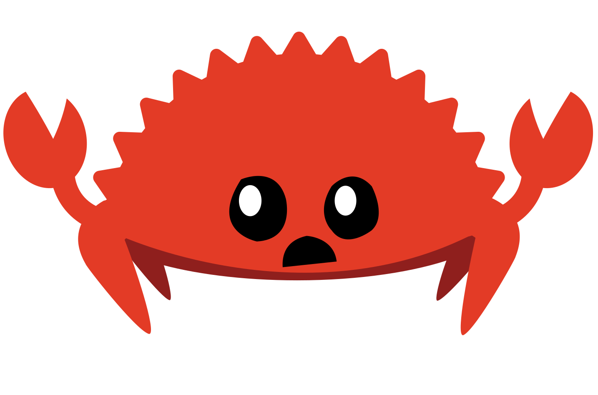
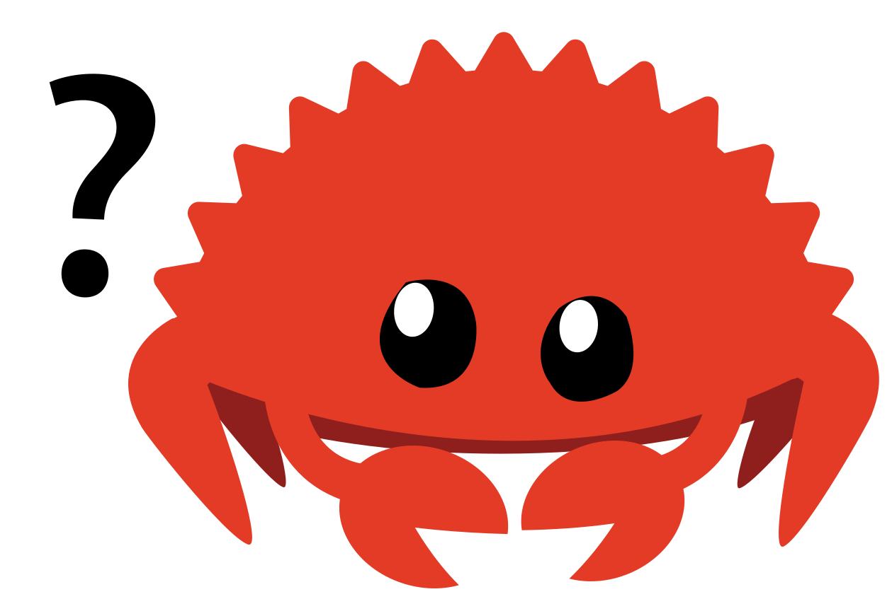

  
  
  

# Learning Rust

A professional learning record of Rust - which will evolve into applications focused on practicing physics, algorithms, game development, socket programming, and beyond - in Rust.

## Goals (Dynamic)

- Learn Rust fundamentals
- Create subprojects for post-degree practice
  - Physics (with Bevy)
  - Algorithms
  - Game Development (with Bevy)
  - Socket Programming (NetSec + Multiplayer Games)
  - Professional Projects
  - Review all course material from degree (and work it in where possible)
- For this git project to be my reference and career demonstration

  ### Note
  - Kill 2 birds with 1 stone is one of my fundamental personal/professional philosophies for maximizing productivity
  - 1 action - 2 (or more) results
  - This Project = (learn rust | practice compSci | market for the jobs I want | prelude to Bevy game)

## Hello World! ... Who am I?

My name is Zach and I hold a Bachelor of Science - Applied Computer Science (Game Development option) from BCIT.

- Note: I also took most (4/5) Network Security Application option courses (out of pocket $$).

I am located in Greater Vancouver Area, British Columbia.

### My Purpose Here

- I must admit - I almost never updated git with my school projects as I went along unless in large groups (which would have been smarter - for much of it). In some cases, like games, the sources are often too large for git anyway (and we used perforce), and in other ways I just don't sharing school work because much of it is the IP of our instructors (and kept private). As well, some major projects I completed for my degree - I formulated in the hopes those efforts could be expanded on into real entrepreneurial outcomes - and don't much like sharing my source or project plans.

- However it makes the job market hard - and so it is in the spirit of practice, marketing, and intellectual exploration - that I have created this project. And learning Rust (an actually new-ish language conceptually, with excellent characteristics for my primary hobbies and professional goals) and so the monotonous process of self-marketing becomes exciting instead.

_Rustacean in training_

## Project

### Step 1 - The Rust Programming Language - Book Read Through

  
   — Currently in progress

Initial objective is to just read through the entire book and do all the primary exercises. There is a exercise guide I'll do after so i didn't mess around with a lot of the extras, it's mostly for beginners (to programming) anyway - and I'm most interested in getting pass this part quickly so i can build real things. However, below - Ill add resource links below to my practice, schedule, and so on.

#### Personal Resources

Here's some quick references that are relevant to me and this leg of the project.

- [Rust Learning Links](./notebooks/00-rust-learing-links.md)
- [TimeSchedule](./schedule/pomodoros-timesheet.ods)

Here's something special. Unlike the cheat sheet below which is more exhaustive to overall syntax related to Rust, I wanted to create a document that digs down specifically on the advantages of the Rust languages, in a shorter form document (for my mindfulness and as reference for others)

- [Rust - Primary Advantages](./notebooks/01-rust-primary-advantages)

#### Cheat Sheets (created on second re-read)

These mostly contain factual statements or code samples from the book without the fluff - for quick reference by me - but I also added more where I had extra questions, wanted more samples, or run tangential experiments. If you have already read the rust book (or have professional coding experience) - might be a faster way to explore Rust (or least skim it's benefits - like safety enforcement - big time).

This is a more rough brain stormy project plan

- [README_Tutorial](./tutorial/Rust%20Prog%20Lang/README_Tutorial_.md)

This is the template project for working on big picture organization (package, modules, structure), understand lib.rs, main.rs, bin/, and a larger projects shape and standards throughout.

- [Template-Project](./tutorial/Rust%20Prog%20Lang/template-project/)

These are my cheat sheets for each chapter

1. [My Cheat Sheet - ch01 - Getting Started](./tutorial/Rust%20Prog%20Lang/ch01/ch01-cheat_sheet.md) - DONE
2. [My Cheat Sheet - ch02 - Getting Started](./tutorial/Rust%20Prog%20Lang/ch02/ch02-cheat_sheet.md) - DONE - but fix writing later.
3. TODO
4. TODO
5. TODO
6. TODO
7. [My Cheat Sheet - ch07 - Packages, Crates, and Modules](./tutorial/Rust%20Prog%20Lang/ch07/ch07-cheat_sheet)
8. TODO
9. TODO
10. [My Cheat Sheet - ch10 - Generic Types, Traits, and Lifelines](./tutorial/Rust%20Prog%20Lang/ch10/ch10-cheat_sheet.md)
11. TODO

---

### Step 2 - Bevy Tutorial

  
   — Blocked

---

### Step 3 - Physics Simulations - Grade 11 Physics Practice

  
   — Blocked

