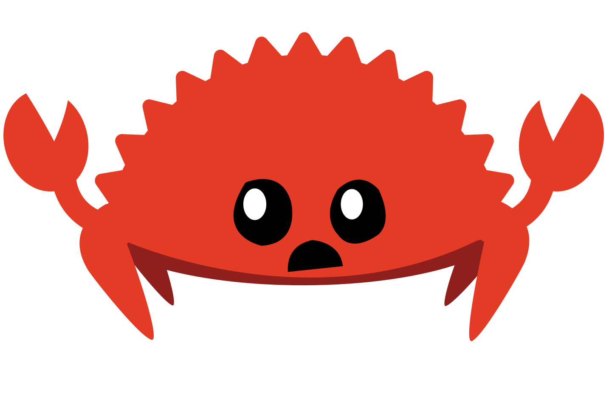
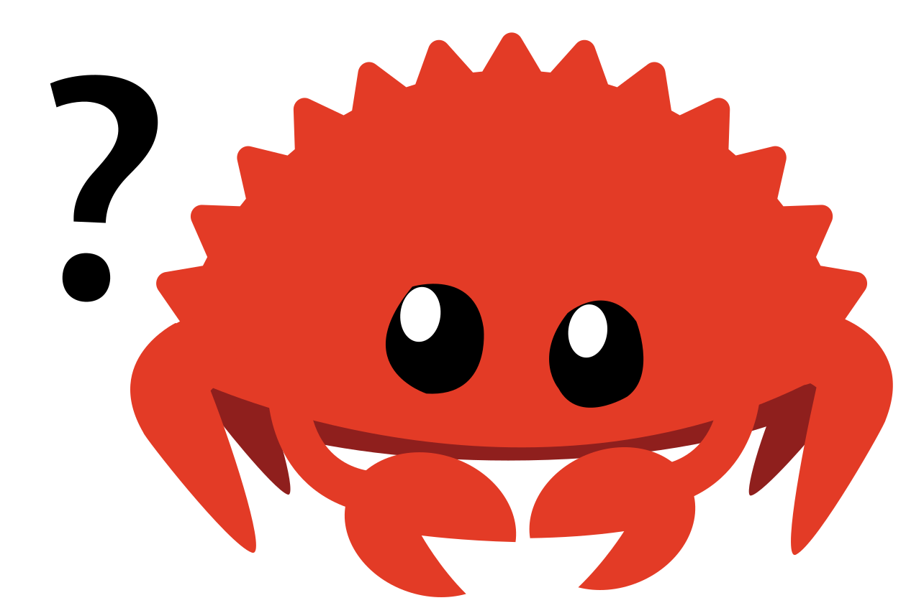

  
  
  

# Learning Rust

A professional learning record of Rust - which will evolve into applications focused on practicing physics, algorithms, game development, socket programming, and beyond - in Rust.

## Goals (Dynamic)

- Learn Rust fundamentals
- Create subprojects for post-degree practice
  - Physics (with Bevy)
  - Algorithms
  - Game Development (with Bevy)
  - Socket Programming (NetSec + Multiplayer Games)
  - Professional Projects
  - Review all course material from degree (and work it in where possible)
- For this git project to be my reference and career demonstration

> [!TIP]
>
> - Kill 2 (or more) birds with 1 stone a fundamental philosophy for maximizing productivity
> - This Project = (learn rust | practice compSci | market for the jobs I want | prelude to Bevy game)

## Hello, World ...?

My name is Zach, I'm a Software Developer based in British Columbia, Canada, and I've achieved a Bachelor of Science degree in Applied Computer Science (Game Development specialty) from BCIT.

- I also completed specialty courses in Network Security Applications.

### Repository Purpose

I didn't do much marketing myself throughout my schooling. I used several git accounts, used perforce for games courses, my major projects are top secret (shh..), and frankly, I don't really like dumping my previous instructors resources on git, and dumping all my old assignments on git after-the-fact is... lame lol.

Frankly - that's where Rust is an excellent avenue. Since Rust has some incredible strengths as a programming language (and novel mechanisms to learn), it's a great place to also review and recreate some of my favorite projects, pursue some more ambitious objectives, and market myself in a more thoughtful way.

So it is in the spirit of practice, marketing, and intellectual exploration - that I have created this project. Rust (an actually new-ish language conceptually, with excellent characteristics for my primary hobbies and professional goals) makes this potentially monotonous process of self-marketing something rather exciting instead.

<table cellpadding="0" cellspacing="0"  bgcolor="#090909"   border="1"
  frame="box"   rules="none">
  <tr>
    <td width="76" valign="middle">
      
    </td>
    <td>
    <blockquote align="left" valign="top">
   <strong>Rustacean in training 
</strong> - (FYI - my comments look like this - in documentation)
      </blockquote>
    </td>
  </tr>
</table>

## Project Orchestration (Flexible)

### Step 1 - The Rust Programming Language - Book Read Through

<table cellpadding="0" cellspacing="0"  bgcolor="#090909"   border="1"
  frame="box"   rules="none">
  <tr>
    <td width="76"  valign="middle"  cellpadding="0"
  cellspacing="0">
      
    </td>
    <td>
     <blockquote align="left" valign="top">
      <strong>Currently in progress</strong>
       </blockquote>
    </td>
  </tr>
</table>

My initial objective is to just read through the entire book and do all the primary exercises to become familiar with the language and it's core mechanisms that have given Rust it's reputation for safety and performance with higher language syntactic sugar.

I'm most interested in getting pass this part quickly so i can build - real things, especially with Bevy, but also other applications. Ill add resource links below to my practice, schedule, exercise ideas, and so on. I'll be updating as I go - so this repository is a large catch all for a bunch of things that I'm willing to share - and is less about producing a thing. It's an educational resource I can publicize, and so inherently dynamic.

#### Personal Resources

Quick references that are relevant to me and this leg of the project.

- [Rust Learning Links](./notebooks/00-rust-learing-links.md)
- [TimeSchedule](./schedule/pomodoros-timesheet.ods)

Here's something special. Unlike the cheat sheet below which is more exhaustive to overall syntax related to Rust, I wanted to create a document that digs down specifically on the advantages of the Rust languages, in a shorter form document (for my mindfulness and as reference for others).<table cellpadding="0" cellspacing="0">

- [Rust - Primary Advantages](./notebooks/01-rust-primary-advantages)

#### Cheat Sheets (created on second re-read)

These mostly contain factual statements or code samples from the book without the fluff - for quick reference by me - but I also added more where I had extra questions, wanted more samples, or run tangential experiments. If you have already read the rust book (or have professional coding experience) - might be a faster way to explore Rust (or least skim it's benefits - like safety enforcement - big time).

This is a more rough brain stormy project plan

- [README_Tutorial](./tutorial/Rust%20Prog%20Lang/README_Tutorial_.md)

This is the template project for working on big picture organization (package, modules, structure), understand lib.rs, main.rs, bin/, and a larger projects shape and standards throughout.

- [Template-Project](./tutorial/Rust%20Prog%20Lang/template-project/)

These are my cheat sheets for each chapter

1. [My Cheat Sheet - ch01 - Getting Started](./tutorial/Rust%20Prog%20Lang/ch01/ch01-cheat_sheet.md) - DONE
2. [My Cheat Sheet - ch02 - Getting Started](./tutorial/Rust%20Prog%20Lang/ch02/ch02-cheat_sheet.md) - DONE - but fix writing later.
3. TODO
4. TODO
5. TODO
6. TODO
7. [My Cheat Sheet - ch07 - Packages, Crates, and Modules](./tutorial/Rust%20Prog%20Lang/ch07/ch07-cheat_sheet)
8. TODO
9. TODO
10. [My Cheat Sheet - ch10 - Generic Types, Traits, and Lifelines](./tutorial/Rust%20Prog%20Lang/ch10/ch10-cheat_sheet.md)
11. [My Cheat Sheet - ch11 - Writing Tests](./tutorial/Rust%20Prog%20Lang/ch11/ch11-cheat-sheet.md) - DONE
12. [My Cheat Sheet - ch12 - An I/O Project: Command Line Program](./tutorial/Rust%20Prog%20Lang/ch12/ch12-cheat_sheet.md)
13. [My Cheat Sheet - ch13 - Functional Language Features: Iterators and Closures](./tutorial/Rust%20Prog%20Lang/ch13/ch13-cheat_sheet.md) - DONE - but fix writing later / review
14. [My Cheat Sheet - ch14 - More About Cargo and Crates.io](./tutorial/Rust%20Prog%20Lang/ch14/ch14-cheat_sheet.md) - Done, but needs more work for final cheat-sheet

---

### Step 2 - Bevy Tutorial

<table cellpadding="0" cellspacing="0"  bgcolor="#090909"   border="1"
  frame="box"   rules="none">
  <tr>
    <td width="76"  valign="middle"  cellpadding="0"
  cellspacing="0">
      
    </td>
    <td>
    <blockquote align="left" valign="top">
      <strong>Blocked / Pending</strong>
      </blockquote>
    </td>
  </tr>
</table>

---

### Step 3 - Physics Simulations - Grade 11 Physics Review

<table cellpadding="0" cellspacing="0"  bgcolor="#090909"   border="1"
  frame="box"   rules="none">
  <tr>
    <td width="76"  valign="middle"  >
      
    </td>
    <td>
      <strong>Blocked / Pending</strong>
    </td>
  </tr>
</table>
